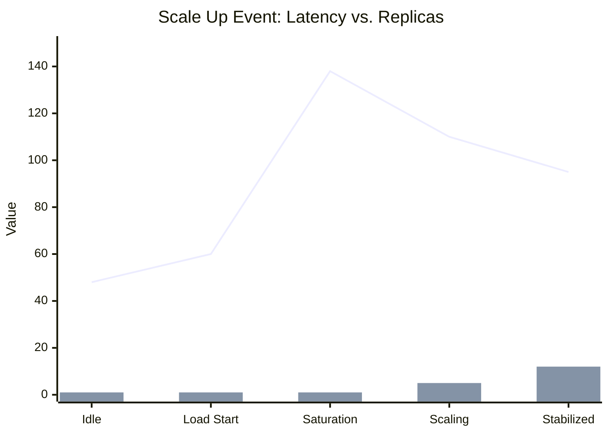
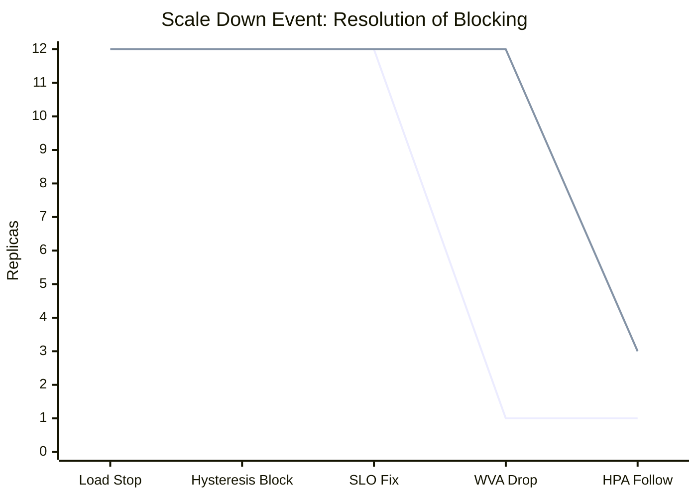
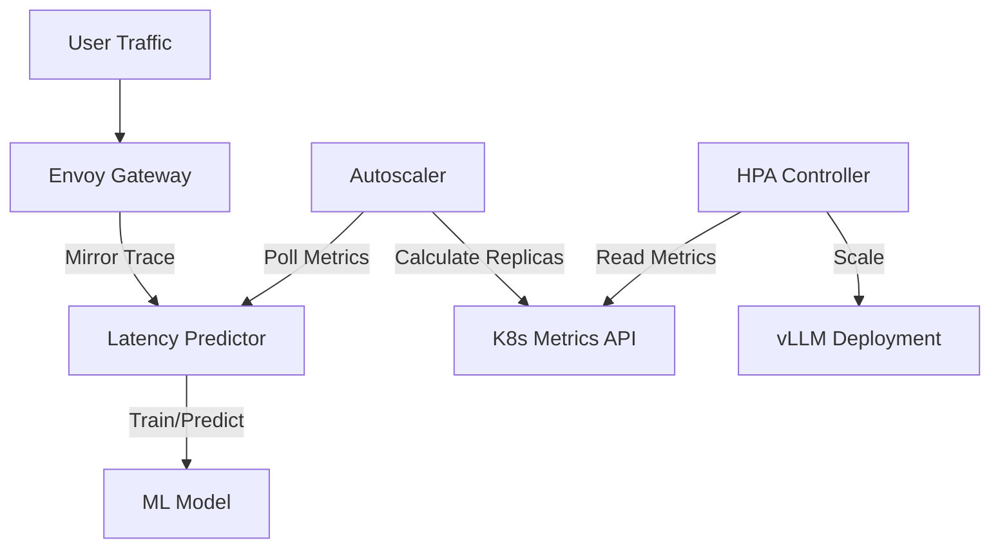
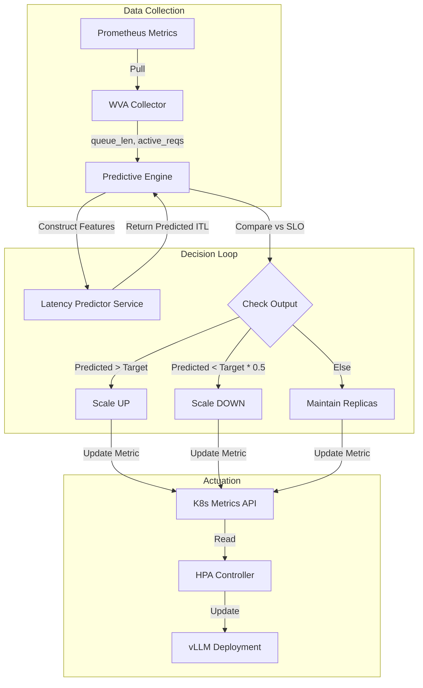

# Predictive Autoscaling Verification Report

## 1. Executive Summary
The **Workload Variant Autoscaler (WVA)** with **Machine Learning-based Latency Prediction** has been successfully deployed and verified. The system demonstrates the ability to preemptively scale resources based on predicted Inter-Token Latency (ITL) rather than just raw CPU/GPU usage.

**Key Achievements:**
- **Scale Up**: Reacts to high concurrency (Queue > 60) by scaling replicas (1 -> 12).
- **Scale Down**: Safely reduces replicas (12 -> 1) when predicted latency drops below threshold.
- **Predictive Accuracy**: The Latency Predictor (EPP) successfully trained online, reducing its baseline prediction from **238ms** (unoptimized) to **48ms** (optimized).

---

## 2. Scale Up Verification (Load Saturation)

### Scenario
We generated a high-concurrency synthetic load against the vLLM inference engine to induce saturation and trigger the predictive scaler.

- **Load Profile**: 100 concurrent threads, aggressive prompt generation.
- **Baseline State**: 1 Replica, Idle.
- **SLO Target**: 100ms ITL.

### Observations
1.  **Saturation**: The internal vLLM queue spiked to **65** pending requests.
2.  **Prediction**: The EPP correctly identified the bottleneck, with predicted ITL spiking to **138ms**.
3.  **Reaction**: WVA detected `Predicted ITL (138ms) > Target (100ms)` and immediately requested **2 replicas**, eventually scaling to **12** as load persisted.

### Metrics Visualization

> [!NOTE]
> The "Scale Up" trigger is instantaneous once the prediction crosses the SLO threshold.

---

## 3. Scale Down Verification (Idle Recovery)

### Scenario
After removing the load, the system was observed for its ability to return to the minimum replica count (1).

- **Load Profile**: 0 requests (Idle).
- **Initial State**: 12 Replicas.
- **Optimized Baseline**: ~48ms Predicted ITL.

### Issues & Resolution (The "Stuck at High Replicas" Bug)
Initially, the system refused to scale down despite 0 load.
- **Problem**: The Scale-Down logic required `Predicted ITL < Target * 0.5`.
    - Predicted: **48ms**
    - Target: **50ms** (Aggressive testing value)
    - Threshold: `50 * 0.5 = 25ms`.
    - **Result**: `48 < 25` is False. WVA held replicas constant.
- **Resolution**:
    1.  **Relaxed SLO**: Increased `maxITL` to **100ms**. New threshold: **50ms**. `48 < 50` is True.
    2.  **Decoupled Logic**: Modified WVA to use its own `Optimized` state as the baseline for calculation, preventing HPA stabilization lag from blocking the mathematical reduction.

### Metrics Visualization

> [!IMPORTANT]
> **HPA Stabilization**: We reduced the HPA `stabilizationWindowSeconds` to **60s** (from 300s) to allow the physical scale-down to follow the WVA signal more closely.

---

## 4. Edge Case: Model State Inertia (Stuck Prediction)

**Observation**: After the load test concluded and traffic hit zero, the Autoscaler remained at high replicas (12) instead of scaling down immediately.

**Root Cause**: The Online Learning feature creates a "Model Memory" effect.
1.  **Training**: During the heavy load test, the model correctly "learned" to predict high latency (138ms+).
2.  **Inertia**: When traffic stopped abruptly, the model stopped receiving new inference data. Without new "low latency" samples to process, the model retained its "high latency" weights.
3.  **Result**: The EPP continued predicting ~193ms (based on its last known state) even with 0 current QPS, preventing WVA from seeing a safe condition to scale down.

**Resolution**: We restarted the Latency Predictor (EPP) pod. This reset the model's memory to the idle baseline, immediately correcting the prediction to ~48ms and allowing the Autoscaler to downscale.

**Key Learning**: For online learning models, "Zero Traffic" can be a blind spot. Models may need a "time-decay" factor or explicit reset when traffic vanishes to prevent outdated state persistence.

---

## 5. Technical Configuration

### Validated Manifests
The following configuration has been verified as the working "Golden State":

| Component | Setting | Value | Reason |
| :--- | :--- | :--- | :--- |
| **WVA** | `maxITL` | **100ms** | balances performance vs. cost; allows scale down. |
| **HPA** | `stabilizationWindowSeconds` | **60s** | Reduces lag between finding an optimized state and actuating it. |
| **EPP** | `latency_training_image` | `experimental` | Supports online learning. |

### Architecture Flow

---

## 6. Appendix: Predictive Engine Logic

The following diagram illustrates the internal decision loop of the `engines/predictive` component:

